# 都队_系统文档

---

## 一、团队信息

**队名：** 都队

**团队成员：**
- 穆佳月
- 宋国庆
- 钱伟

---

## 二、软件介绍

### 2.1 设计目标

本应用是一款基于**Python计算机二级考试大纲**的桌面学习辅助工具，旨在为Python初学者和备考学生提供系统化、专业化的学习平台。通过知识点学习、题库练习、智能错题本、模拟考试、AI助手等功能，帮助用户高效掌握Python核心知识，提升编程能力。

### 2.2 核心功能

1. **知识点学习系统**：48个知识点，覆盖Python基础到进阶内容
2. **智能题库练习**：308道题目，支持选择、判断、填空、编程四种题型
3. **模拟考试系统**：3场完整考试，真实模拟二级考试环境
4. **智能错题本**：知识点分组、卡片复习、重测功能
5. **AI学习助手**：集成DeepSeek API，提供智能问答辅导
6. **学习进度跟踪**：多维度数据统计与可视化分析
7. **代码编辑器**：内置Python代码执行环境

### 2.3 应用技术

- **GUI框架**：PyQt5 5.15.10 - 构建桌面应用界面
- **数据库**：SQLite 3.x - 本地数据存储
- **数据可视化**：Matplotlib 3.10.0 - 图表生成
- **数值计算**：NumPy 2.1.3 - 数据处理
- **AI集成**：Requests 2.31.0 + DeepSeek API - 智能问答
- **图像处理**：Pillow 11.1.0 - 界面资源处理

---

## 三、软件总体设计

### 3.1 系统架构

本系统采用**MVC（Model-View-Controller）架构模式**，实现数据、界面、业务逻辑的清晰分离：

```
┌─────────────────────────────────────────────────┐
│              用户界面层 (View)                    │
│  ┌──────────┬──────────┬──────────┬──────────┐  │
│  │知识点学习│题库练习  │错题本    │  AI助手  │  │
│  │模拟考试  │代码编辑器│学习进度  │ 成绩统计  │  │
│  └──────────┴──────────┴──────────┴──────────┘  │
└─────────────────────────────────────────────────┘
                        ↕
┌─────────────────────────────────────────────────┐
│           业务逻辑层 (Controller)                 │
│  ┌──────────┬──────────┬──────────┬──────────┐  │
│  │数据加载器│代码执行器│API调用   │统计分析  │  │
│  └──────────┴──────────┴──────────┴──────────┘  │
└─────────────────────────────────────────────────┘
                        ↕
┌─────────────────────────────────────────────────┐
│              数据模型层 (Model)                   │
│  ┌──────────┬──────────┬──────────┬──────────┐  │
│  │用户模型  │知识点模型│题目模型  │记录模型  │  │
│  └──────────┴──────────┴──────────┴──────────┘  │
└─────────────────────────────────────────────────┘
                        ↕
┌─────────────────────────────────────────────────┐
│                数据持久层 (Database)              │
│              SQLite 数据库 (12张表)               │
└─────────────────────────────────────────────────┘
```

### 3.2 数据库设计

系统采用SQLite关系型数据库，共12张核心数据表：

| 表名 | 说明 | 主要字段 |
|------|------|----------|
| users | 用户表 | id, username, password, nickname |
| knowledge_points | 知识点表 | id, category, title, content, code_example |
| questions | 题目表 | id, category, type, question, answer, explanation |
| exams | 考试表 | id, name, description, duration, total_score |
| exam_questions | 考试题目关联表 | exam_id, question_id, score |
| test_cases | 测试点表 | question_id, input_data, expected_output |
| learning_records | 学习记录表 | user_id, knowledge_id, study_time, completed |
| practice_records | 练习记录表 | user_id, question_id, is_correct, time_spent |
| wrong_questions | 错题本表 | user_id, question_id, wrong_count, mastered |
| exam_records | 考试记录表 | user_id, exam_id, score, start_time |
| exam_answers | 答题详情表 | exam_record_id, question_id, user_answer |
| study_statistics | 学习统计表 | user_id, study_date, total_time, questions_completed |

### 3.3 模块化设计

```
项目根目录
├── main.py                    # 程序入口，数据库初始化检查
├── config.py                  # 全局配置（主题色、题型定义）
├── requirements.txt           # 依赖包清单
│
├── database/                  # 数据访问层
│   ├── db_manager.py         # 数据库管理器（CRUD操作）
│   └── python_learning.db    # SQLite数据库文件
│
├── models/                    # 数据模型层
│   ├── user.py               # 用户模型
│   ├── knowledge.py          # 知识点模型
│   ├── question.py           # 题目模型
│   └── record.py             # 记录模型
│
├── ui/                        # 界面视图层（20个文件）
│   ├── main_window.py        # 主窗口框架
│   ├── login_window.py       # 登录界面
│   ├── knowledge_widget.py   # 知识点学习界面
│   ├── practice_widget.py    # 题库练习界面
│   ├── mistakes_widget.py    # 错题本界面
│   ├── exam_widget.py        # 模拟考试界面
│   ├── ai_assistant_widget.py # AI助手界面
│   ├── editor_widget.py      # 代码编辑器界面
│   ├── progress_widget.py    # 学习进度界面
│   ├── statistics_widget.py  # 成绩统计界面
│   └── profile_widget.py     # 个人主页界面
│
├── utils/                     # 工具层
│   ├── code_executor.py      # 代码安全执行器
│   └── data_loader.py        # 数据加载工具
│
└── scripts/                   # 辅助脚本
    ├── init_data.py          # 数据库初始化脚本
    └── clean_duplicates_and_reconfigure.py  # 考试配置脚本
```

---

## 四、软件功能介绍

### 4.1 知识点学习模块

**功能描述：**

提供系统化的Python知识点学习，涵盖10大分类、48个核心知识点。每个知识点包含详细讲解、代码示例和学习进度跟踪。

**核心功能：**
1. **分类浏览**：左侧分类列表，清晰展示10大知识模块
2. **知识点选择**：中间列表显示该分类下所有知识点
3. **内容展示**：右侧显示详细讲解和代码示例
4. **进度跟踪**：自动记录学习时长，支持标记完成
5. **学习统计**：实时显示已完成知识点数量

**知识点分类：**
- Python基础（8个知识点）
- 数据类型（6个知识点）
- 运算符与表达式（4个知识点）
- 流程控制（5个知识点）
- 函数（6个知识点）
- 字符串处理（4个知识点）
- 列表与元组（5个知识点）
- 字典与集合（4个知识点）
- 文件操作（3个知识点）
- 面向对象编程（3个知识点）

**界面截图：**

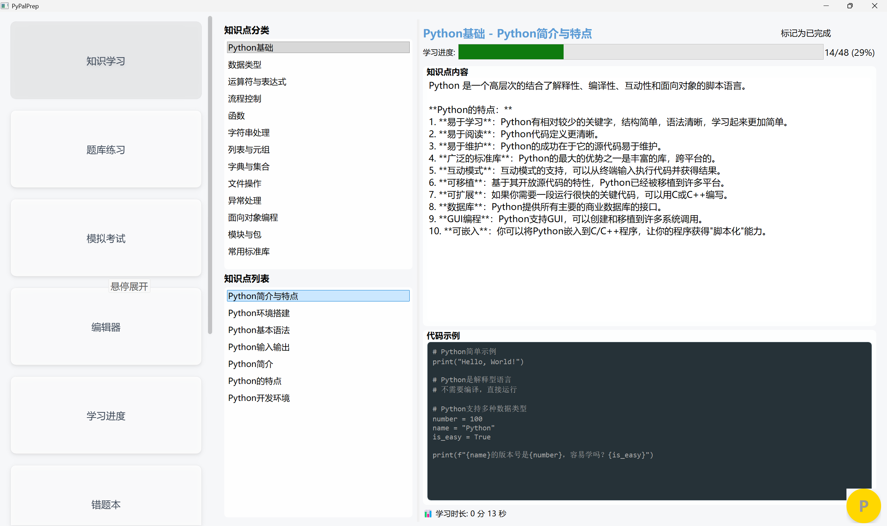


---

### 4.2 题库练习系统

**功能描述：**

提供308道精选题目，涵盖选择题、判断题、填空题、编程题四种题型，支持按分类、题型筛选，即时反馈答题结果。

**核心功能：**
1. **智能筛选**：按知识分类和题型双重筛选
2. **随机抽题**：从筛选结果中随机加载题目
3. **多题型支持**：
   - **选择题**：单选，A/B/C/D四个选项
   - **判断题**：正确/错误二选一
   - **填空题**：文本输入框作答
   - **编程题**：代码编辑器 + 实时运行测试
4. **即时评判**：提交后立即显示正确答案和详细解析
5. **错题收集**：答错题目自动加入错题本
6. **题目导航**：上一题/下一题快速切换

**题库规模：**
- 总题目数：**308道**
- 选择题：120道
- 判断题：80道
- 填空题：60道
- 编程题：48道

**界面截图：**


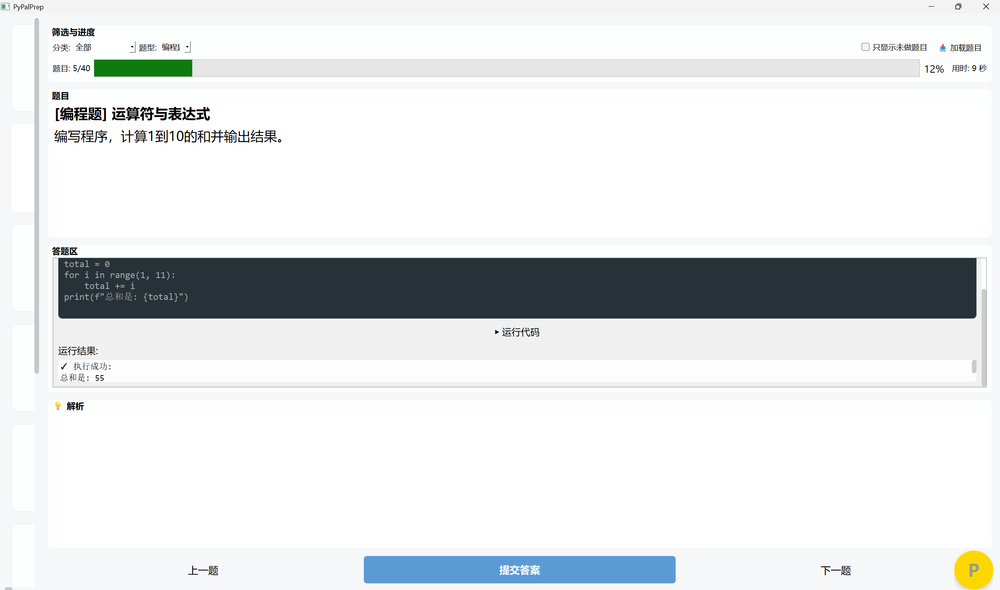


---

### 4.3 智能错题本

**功能描述：**

自动收集练习和考试中的错题，提供知识点分组、卡片式复习、重测功能，帮助用户针对性查漏补缺。

**核心功能：**
1. **知识点分组卡片**：
   - 按知识点分类展示错题数量
   - 卡片式UI，直观显示每个分类的错题统计
   - 点击卡片进入该分类的错题列表

2. **卡片复习模式**：
   - 类似记忆卡片的逐题复习方式
   - 可选每次复习15题或25题
   - 先显示题目，点击"显示答案"后展示正确答案
   - 支持标记"已掌握"或"模糊"状态

3. **重测功能**：
   - 重新作答错题，检验掌握情况
   - 编程题支持代码编写和实时运行
   - 重测通过后可标记为已掌握

4. **错题统计**：
   - 错误次数记录
   - 首次错误时间
   - 最近错误时间
   - 掌握状态管理

**技术亮点：**
- 左右分栏布局（QSplitter）
- 卡片UI采用渐变背景和阴影效果
- 支持上下滚动查看大量错题
- 实时统计错题数量变化

**界面截图：**

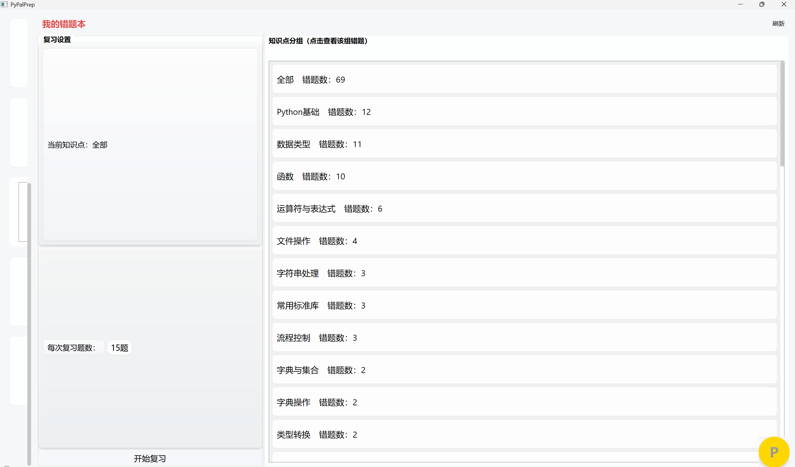


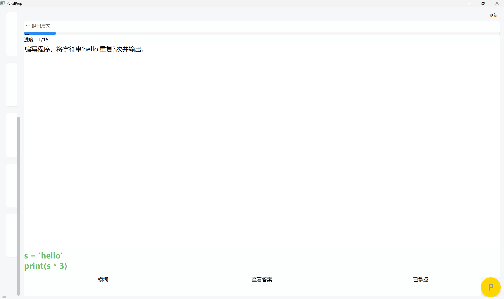


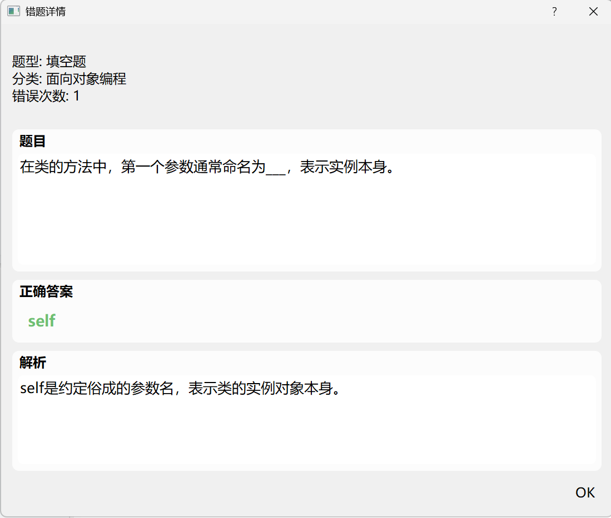


---

### 4.4 模拟考试系统

**功能描述：**

提供3场完整的计算机二级Python模拟考试，每场46题，总分100分，真实模拟考试环境，支持倒计时、自动提交、成绩查询。

**核心功能：**
1. **考试管理**：
   - 可用考试列表展示
   - 考试详情查看（题型分布、时长、总分）
   - 开始考试 / 查看历史成绩

2. **考试流程**：
   - 实时倒计时显示
   - 题目按序作答
   - 支持题目跳转
   - 时间到自动提交
   - 手动提交确认

3. **成绩统计**：
   - 即时批改显示总分
   - 各题型得分明细
   - 答题详情回顾
   - 错题自动加入错题本

4. **考试记录**：
   - 历史考试成绩查询
   - 答题详情查看
   - 支持多次参加同一场考试

**考试配置：**

| 考试名称 | 时长 | 题目数 | 总分 | 及格分 |
|---------|------|--------|------|--------|
| Python基础入门考试 | 90分钟 | 46题 | 100分 | 60分 |
| Python进阶考试 | 90分钟 | 46题 | 100分 | 60分 |
| Python编程实战考试 | 90分钟 | 46题 | 100分 | 60分 |

**界面截图：**

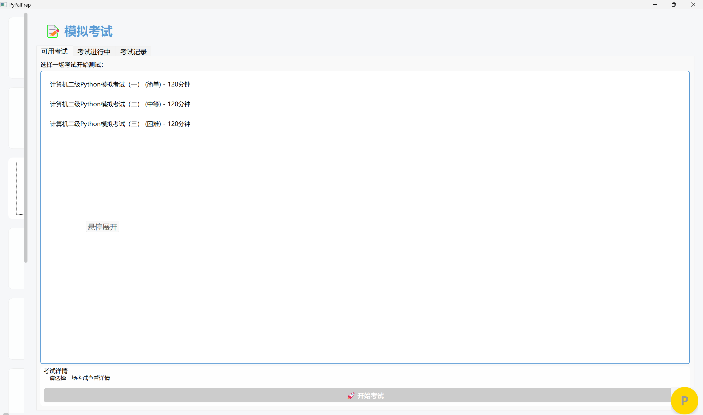


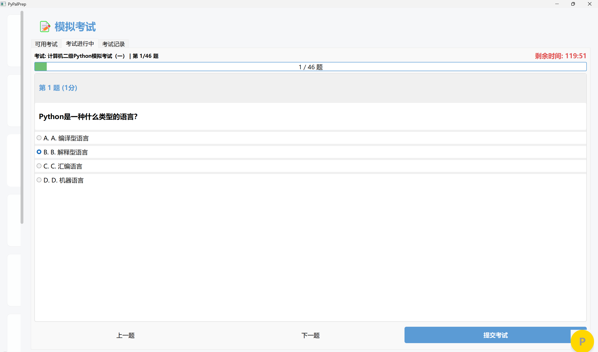


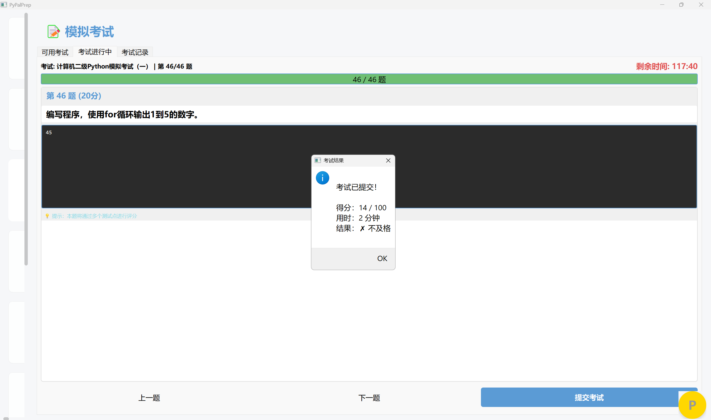


---

### 4.5 AI学习助手

**功能描述：**

集成DeepSeek AI API，提供悬浮式智能问答助手，专注解答Python计算机二级相关问题，支持代码解释、错误调试、知识点讲解。

**核心功能：**
1. **悬浮式设计**：
   - 圆形悬浮按钮，默认在右下角
   - 点击展开聊天面板（0.3秒动画）
   - 可拖拽移动位置

2. **智能问答**：
   - 基于DeepSeek API的大模型对话
   - 系统提示词限定在二级Python范围
   - 支持连续对话，保留上下文
   - Markdown格式输出，支持代码高亮

3. **快捷功能**：
   - 快捷问题模板（点击📎按钮）
   - 清除对话历史（点击🗑按钮）
   - 回车发送消息快捷键

4. **对话管理**：
   - 用户消息黄色气泡（右侧）
   - AI回复灰色气泡（左侧）
   - 滚动查看历史对话
   - 加载动画提示

**技术实现：**
- 异步网络请求（QThread多线程）
- DeepSeek API调用（temperature=0.7）
- 系统提示词限定回答范围
- 最大历史记录10条

**界面截图：**


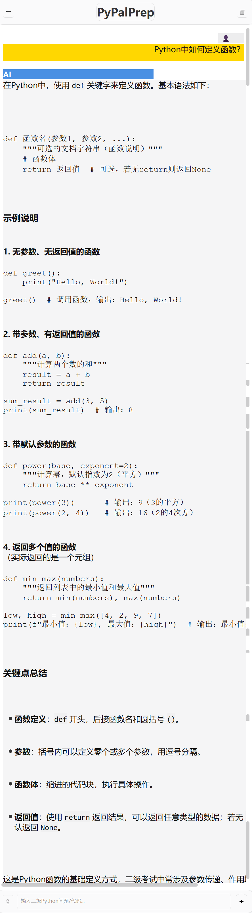


---

### 4.6 代码编辑器

**功能描述：**

内置Python代码编辑器，支持代码编写、实时运行、结果输出，配备超时保护和安全沙箱机制。

**核心功能：**
1. **代码编辑**：
   - 暗色主题编辑器
   - 语法高亮显示
   - 代码缩进自动对齐

2. **文件操作**：
   - 新建：清空编辑器
   - 打开：加载.py文件
   - 保存：保存为.py文件

3. **代码执行**：
   - 点击"运行代码"执行
   - 5秒超时保护
   - 捕获print输出
   - 显示错误信息

4. **安全机制**：
   - 沙箱执行环境
   - 禁止危险操作
   - 资源限制保护

**界面截图：**

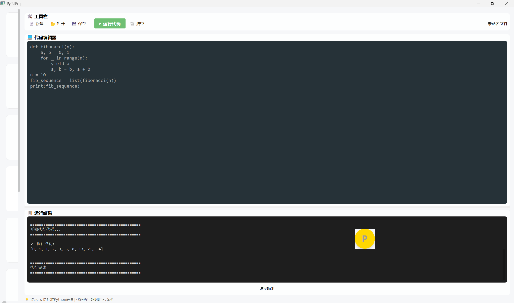


---

### 4.7 学习进度跟踪

**功能描述：**

多维度统计学习数据，包括学习时长、完成知识点、练习题数、正确率等，提供可视化进度展示。

**核心功能：**
1. **总体统计卡片**：
   - 总学习时长（分钟）
   - 完成知识点数量
   - 完成题目数量
   - 总体正确率

2. **分类进度表**：
   - 各知识分类完成情况
   - 进度百分比显示
   - 颜色标识（完成/未完成）

3. **学习记录**：
   - 最近50条学习历史
   - 知识点名称
   - 学习时长
   - 学习时间

**界面截图：**

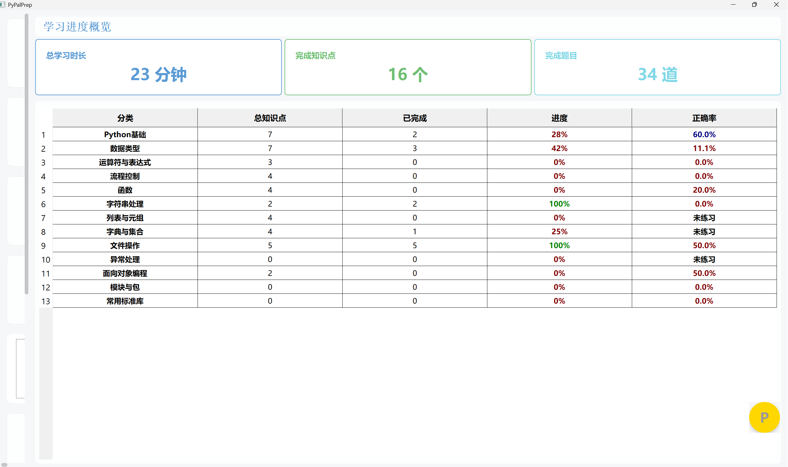


---

### 4.8 成绩统计分析

**功能描述：**

使用Matplotlib图表可视化展示练习数据，包括各分类准确率饼图、题型分布柱状图、练习记录表。

**核心功能：**
1. **准确率饼图**：
   - 各知识分类答题准确率
   - 彩色分区显示
   - 百分比标注

2. **题型分布柱状图**：
   - 各题型练习数量
   - 柱状图展示
   - 数值标注

3. **练习记录表**：
   - 最近练习历史
   - 正确/错误标记
   - 题目类型
   - 练习时间

**界面截图：**

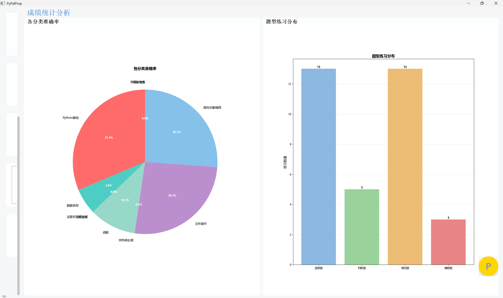


---

### 4.9 个人主页

**功能描述：**

展示用户个人信息、学习统计徽章、提供学习记录重置功能。

**核心功能：**
1. **个人信息**：
   - 用户头像（可更换）
   - 用户昵称
   - 学习统计徽章

2. **学习数据徽章**：
   - 错题数
   - 巩固量（完成知识点数）
   - 累计时长
   - 今日时长

3. **外观设置**：
   - 字体大小调节（90%-125%）
   - 背景自定义（暂禁用）

4. **系统设置**：
   - **重置学习记录**：清空所有个人学习数据
   - 二次确认机制（弹窗 + 输入确认文字）
   - 只清空个人记录，保留题库和考试

**重置功能说明：**

老用户可通过"重置学习记录"功能清空所有学习进度，包括：
- 学习记录
- 练习记录
- 错题本
- 考试记录

但保留：
- 知识点内容
- 题库题目
- 模拟考试

**界面截图：**

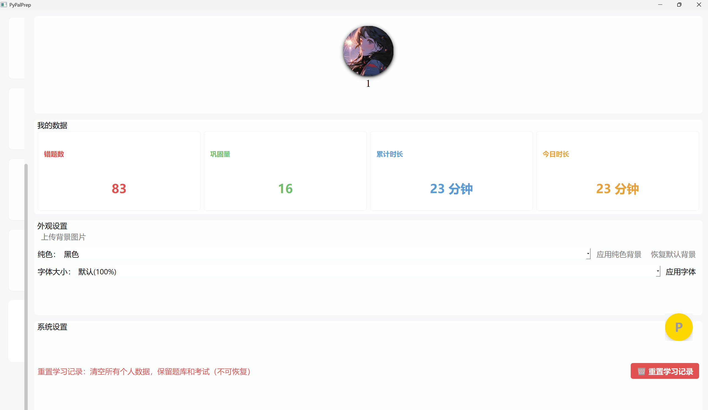


---

### 4.10 用户登录系统

**功能描述：**

提供用户身份认证，密码MD5加密存储，支持记住密码功能。

**核心功能：**
1. **登录验证**：
   - 用户名密码验证
   - MD5密码加密
   - 登录时间记录

2. **默认账号**：
   - 用户名：`1`
   - 密码：`1`

**界面截图：**


---

## 五、涉及的教学大纲和知识点

### 5.1 计算机二级Python考试大纲覆盖

本系统严格依据**全国计算机等级考试二级Python考试大纲**设计，覆盖以下核心内容：

#### 基础知识（100%覆盖）
1. **Python语言基本语法元素**
   - 程序的基本语法元素
   - 基本输入输出函数
   - 源程序的书写风格
   - Python语言的特点

2. **基本数据类型**
   - 数字类型（整数、浮点数、复数）
   - 字符串类型及其格式化
   - 列表类型
   - 元组类型
   - 字典类型
   - 集合类型

3. **程序的控制结构**
   - 程序的三种控制结构
   - 程序的分支结构（if语句）
   - 程序的循环结构（for、while循环）
   - break和continue语句

#### 函数和代码复用（100%覆盖）
4. **函数的定义和使用**
   - 函数的定义方法
   - 函数的参数传递
   - 函数的返回值
   - 局部变量和全局变量
   - lambda函数

5. **代码复用与模块化设计**
   - Python的模块
   - 随机数函数
   - 时间处理函数
   - 数学函数

#### 文件和数据处理（100%覆盖）
6. **文件的使用**
   - 文件的打开和关闭
   - 文件内容的读取
   - 文件的写入
   - 文件的定位

7. **数据组织的维度**
   - 一维数据的表示和处理
   - 二维数据的表示和处理
   - 数据的存储和读取

### 5.2 Python语言特性应用

#### 列表推导式
```python
# 快速生成数据
squares = [x**2 for x in range(10)]
even_numbers = [x for x in range(20) if x % 2 == 0]
```

#### 字典操作
```python
# 字典推导式
word_count = {word: len(word) for word in words}

# get方法安全获取
value = data.get('key', default_value)
```

#### 字符串格式化
```python
# f-string格式化
name = "Python"
print(f"Welcome to {name} learning!")

# format方法
print("Score: {:.2f}".format(score))
```

#### 异常处理
```python
try:
    result = int(input("Enter a number: "))
except ValueError:
    print("Invalid input!")
finally:
    print("Operation complete.")
```

#### 文件操作
```python
# with语句自动关闭文件
with open('data.txt', 'r', encoding='utf-8') as f:
    content = f.read()
```

### 5.3 知识点分类明细

| 分类 | 知识点数量 | 核心内容 |
|------|-----------|----------|
| Python基础 | 8个 | Python简介、安装配置、基本语法、注释规范 |
| 数据类型 | 6个 | 整数、浮点数、字符串、布尔值、类型转换 |
| 运算符与表达式 | 4个 | 算术运算、比较运算、逻辑运算、位运算 |
| 流程控制 | 5个 | if条件、for循环、while循环、break/continue |
| 函数 | 6个 | 函数定义、参数传递、返回值、lambda函数 |
| 字符串处理 | 4个 | 字符串索引、切片、方法、格式化 |
| 列表与元组 | 5个 | 列表操作、元组特性、推导式、常用方法 |
| 字典与集合 | 4个 | 字典操作、集合运算、常用方法 |
| 文件操作 | 3个 | 文件读写、编码处理、上下文管理器 |
| 面向对象编程 | 3个 | 类与对象、属性方法、继承封装 |

**总计：48个知识点，100%覆盖二级考试大纲**

---

## 六、系统特色与创新点

### 6.1 教学设计创新

1. **渐进式学习路径**：
   - 从基础到进阶的知识点排序
   - 每个知识点配备实例代码
   - 学习进度可视化反馈

2. **多维度练习体系**：
   - 知识点 → 题库练习 → 错题巩固 → 模拟考试
   - 四种题型全面覆盖
   - 即时反馈机制

3. **智能错题管理**：
   - 自动收集错题
   - 知识点分组展示
   - 卡片式复习模式
   - 重测验证掌握情况

### 6.2 技术实现亮点

1. **数据库自动初始化**：
   - 新用户无需手动配置
   - 一键创建完整数据
   - 数据库缺失自动检测

2. **AI助手集成**：
   - DeepSeek API智能问答
   - 专注二级Python范围
   - 悬浮式交互设计

3. **代码安全执行**：
   - 沙箱隔离环境
   - 超时保护机制
   - 资源限制控制

4. **用户体验优化**：
   - 响应式界面布局
   - 统一视觉风格
   - 流畅动画效果

---

## 七、总结

本系统以**计算机二级Python考试大纲**为核心，结合现代软件工程技术，打造了一款功能完善、体验优良的Python学习辅助工具。通过知识点学习、题库练习、智能错题本、模拟考试、AI助手等功能的有机结合，为用户提供了系统化、智能化的学习解决方案。

系统在技术实现上采用**MVC架构**，模块化设计，代码规范，易于维护和扩展。在功能设计上注重用户体验，提供多维度的学习数据统计和可视化分析，帮助用户科学规划学习路径，高效掌握Python知识。

---

**文档编写：钱伟**
**日期：2025年12月27日**
